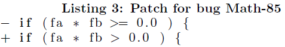

## Time Analysis
* execution time very similar for jmutrepair and jkali for different scopes, because they are not locality aware
* but once solutions were found on different localities (math 81) because global had an IllegalState Exception  
* often package and local had very similar runtimes, but occasionally (math 70, 73, 76, 77, 81, 86, 89) local was much faster, because the scope is smaller
* in general package runs much faster than global, because the scope is much smaller
* in general our executions took considerably longer to run astor than the paper (factor 2 - 5), probably due to the hardware, but it was not stated in the paper
*  very similar ration on time comparison between scopes (see chart Time Comparison)


## Fix Comparison:
* for the math problems 50 - 89 we found less solutions, than the paper
Because:
  * jmutrepair often had an IllegalStateException, where it could not find any variation and therefore, no fixes
  * for math 50, 71, 78, 82 we did not find a fix with any of the specs, this might be due to a different version of astor, and or a different seed - TODO: analyze further


### Math 70

jgenprog local found this fix in 38.298 seconds

**Original statement:**

```return solve(min, max)```

**Fixed statement:**

```return solve(f, min, max)```

**Notes:**

* Equivalent to solution present in paper
* correct reparation
* also implemented by the project developer (see astor paper)


### Math 85

Found by jkali local
, jkali package, jkali gobal, jgenprog local, jgenprog package

**Original statement:**

```throw new org.apache.commons.math.ConvergenceException(("number of iterations={0}, maximum iterations={1}, " + ("initial={2}, lower bound={3}, upper bound={4}, final a value={5}, " + "final b value={6}, f(a)={7}, f(b)={8}")), numIterations, maximumIterations, initial, lowerBound, upperBound, a, b, fa, fb)```

**Fixed statement:**

``````

``````

**Notes:**

* just removed the throw of the exception
* different from the paper, see snippet below
* stoped here, because we have set stopfirst to true




### Math 50

No Solution found!

## Exception Analysis

### IllegalStateException 
*Variant without any modification point. It must have at least one.*

* for unkwown reasons, jmutreapair finds some suspicious files/ points but reduces them all to none
* if the flthreshold is lower, 0.1, it is more likely to not throw the exception (see table Jmutrepair with threshhold 0.1)

### SpoonException	
*Cannot insert a statement before a super or this invocation.* 

* the source code for math 51 to be fixed is a constructor calling a constructor from a super class and spoon cannot interact with those
