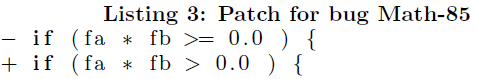

## Solution Comparison:

### Math 70

jgenprog local found this fix in 38.298 seconds

**Original statement:**

```return solve(min, max)```

**Fixed statement:**

```return solve(f, min, max)```

**Notes:**

* Equivalent to solution present in paper
* correct reparation
* also implemented by the project developer (see astor paper)


### Math 85

Found by jkali loca, jkali package, jkali gobal, jgenprog local, jgenprog package

**Original statement:**

```throw new org.apache.commons.math.ConvergenceException(("number of iterations={0}, maximum iterations={1}, " + ("initial={2}, lower bound={3}, upper bound={4}, final a value={5}, " + "final b value={6}, f(a)={7}, f(b)={8}")), numIterations, maximumIterations, initial, lowerBound, upperBound, a, b, fa, fb)```

**Fixed statement:**

``````

``````

**Notes:**

* just removed the throw of the exception
* different from the paper, see snippet below
* not solving the problem at all!




### Math 50

No Solution found!

